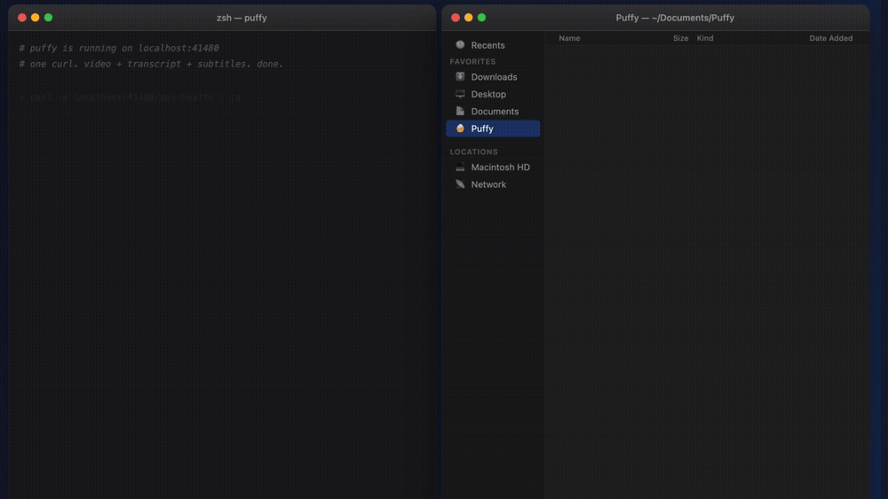

<h1 align="center" id="readme-top">
  Puffy 公共引擎
</h1>

<p align="center">
  <b>贴一个公开视频链接，拿回一组干净的本地文件。</b><br>
  开源 CLI + 本地 API + Python 客户端，给那些想要可脚本化引擎的人，<br>
  不是给你继续手搓一串工具链用的。
</p>

<p align="center">
  <a href="https://github.com/susu-pro/puffy/stargazers"></a>
  
  
  <a href="https://github.com/susu-pro/puffy/blob/main/LICENSE"></a>
</p>

<p align="center">
  
</p>

<p align="center">
  <a href="#get-started"><strong>快速开始</strong></a> ·
  <a href="#local-api"><strong>API</strong></a> ·
  <a href="#python-client"><strong>Python</strong></a> ·
  <a href="#runtime-policy"><strong>Runtime</strong></a> ·
  <a href="./README.md">🇺🇸 English</a>
</p>

---

这个仓就是 Puffy 的开源引擎。

如果你想要的是：

- 本地优先 CLI
- localhost API
- 给脚本和工作流用的小型 Python 客户端
- 可自托管的 Docker 入口

那你来对地方了。

如果你只是想直接下载安装包，请去 [`susu-pro/puffy-download`](https://github.com/susu-pro/puffy-download/releases)。

## 这个仓最适合干什么

这个仓是给那些想把“媒体转本地文本资产”自动化掉的人准备的，不是给你继续手搓一串工具链用的。

你可以拿它来：

- 给一个公开 URL，交给本地流程处理
- 拿回一组 agent、RAG、笔记系统都能复用的文件
- 把 Puffy 当成一个很小的 localhost 服务来跑
- 在一个简单、可读的接口面上搭你自己的工作流

最适合的人：

- CLI 用户
- 本地 API 接入方
- Python 工作流开发者
- n8n / Dify / Open WebUI 折腾党
- 关心引擎行为和 runtime 规则的贡献者

## 哪些东西不在这个仓里

这个仓故意不是完整桌面产品。

这里不放：

- 桌面 GUI 壳
- updater
- crash reporting / telemetry
- 私有发版链路
- 还没通过公开门禁的 runtime 二进制

<a id="get-started"></a>

## 60 秒开始

### 本地跑起来

```bash
cargo run -p puffy-cli -- doctor
cargo run -p puffy-cli -- serve
curl http://127.0.0.1:41480/api/health
```

### 规划一个提取任务

```bash
cargo run -p puffy-cli -- extract "https://www.youtube.com/watch?v=dQw4w9WgXcQ"
```

指定 profile 和输出目录：

```bash
cargo run -p puffy-cli -- extract \
  "https://www.youtube.com/watch?v=dQw4w9WgXcQ" \
  --profile audio-only \
  --save-dir "$HOME/Documents/Puffy"
```

### 用 Docker 跑

```bash
docker build -t puffy-engine .
docker run --rm -p 41480:41480 puffy-engine
```

容器默认启动 `puffy serve`。

## 它现在能处理哪些来源

目前来源规范化覆盖：

- YouTube
- TikTok
- Douyin
- Bilibili
- X / Twitter
- 小红书
- 快手
- Instagram

像 `x.com` 这样的 host alias 会自动归一。

<a id="local-api"></a>

## 本地 API

API 很小，故意保持简单：

- `GET /health`
- `GET /api/health`
- `POST /api/extract`
- `GET /api/jobs/{job_id}`
- `GET /api/assets`
- `GET /api/search`

### 健康检查

```bash
curl http://127.0.0.1:41480/api/health
```

示例返回：

```json
{
  "status": "ok",
  "name": "Puffy Public Engine",
  "version": "0.1.0-rehearsal"
}
```

### 提交一个任务

```bash
curl -X POST http://127.0.0.1:41480/api/extract \
  -H "Content-Type: application/json" \
  -d '{"url":"https://www.youtube.com/watch?v=dQw4w9WgXcQ"}'
```

示例返回：

```json
{
  "status": "queued",
  "jobId": "asset-job-1743040100000-12345",
  "message": "Asset job queued. Poll /api/jobs/{job_id} for progress.",
  "checkUrl": "/api/jobs/asset-job-1743040100000-12345"
}
```

### 轮询任务状态

```bash
curl http://127.0.0.1:41480/api/jobs/asset-job-1743040100000-12345
```

### 搜索或列出资产

```bash
curl "http://127.0.0.1:41480/api/assets?limit=10"
curl "http://127.0.0.1:41480/api/search?q=knowledge+asset&limit=5"
```

<a id="python-client"></a>

## Python 客户端

小型 Python 客户端在 [`clients/python`](./clients/python)。

本地安装：

```bash
cd clients/python
pip install -e .
```

快速示例：

```python
from puffy_client import PuffyClient

client = PuffyClient()
health = client.health()
accepted = client.extract_async("https://www.youtube.com/watch?v=dQw4w9WgXcQ")
job = client.wait_for_job(accepted.job_id, poll_interval=1.0, timeout=30.0)
hits = client.search("knowledge asset", limit=5)
```

## 你最终会拿到什么

默认情况下，Puffy 会在 `~/Documents/Puffy` 下规划一个本地资产目录。

目标输出长这样：

- `video.mp4` 或 `audio.m4a`
- `transcript.txt`
- `transcript.md`
- `subtitle.srt`
- `subtitle.vtt`
- `segments.json`
- `chunks.jsonl`
- `chapters.json`

下游工具真正该依赖的是这批干净文件，不是桌面壳细节。

<a id="runtime-policy"></a>

## Runtime 规则

公开引擎对 runtime 很谨慎。

当前这个仓不会直接分发内置 `yt-dlp`、`ffmpeg`、`ffprobe`。
只有当版本、来源、哈希、签名和 smoke 状态都锁定以后，它们才允许回到公开分发。

公开 runtime 文件在这里：

- [`runtime/runtime.lock.json`](./runtime/runtime.lock.json)
- [`runtime/README.md`](./runtime/README.md)

## 仓结构

```text
.
├── crates/
│   ├── puffy-core/
│   └── puffy-cli/
├── clients/
│   └── python/
├── docker/
├── examples/
└── runtime/
```

## 接下来去哪看

- 示例：[`examples/`](./examples)
- 示例索引：[`examples/README.md`](./examples/README.md)
- 自托管说明：[`docker/selfhosted.md`](./docker/selfhosted.md)
- runtime 规则：[`runtime/README.md`](./runtime/README.md)
- 公开安装包：[`susu-pro/puffy-download`](https://github.com/susu-pro/puffy-download/releases)

## 许可证

MIT，见 [`LICENSE`](./LICENSE)。
